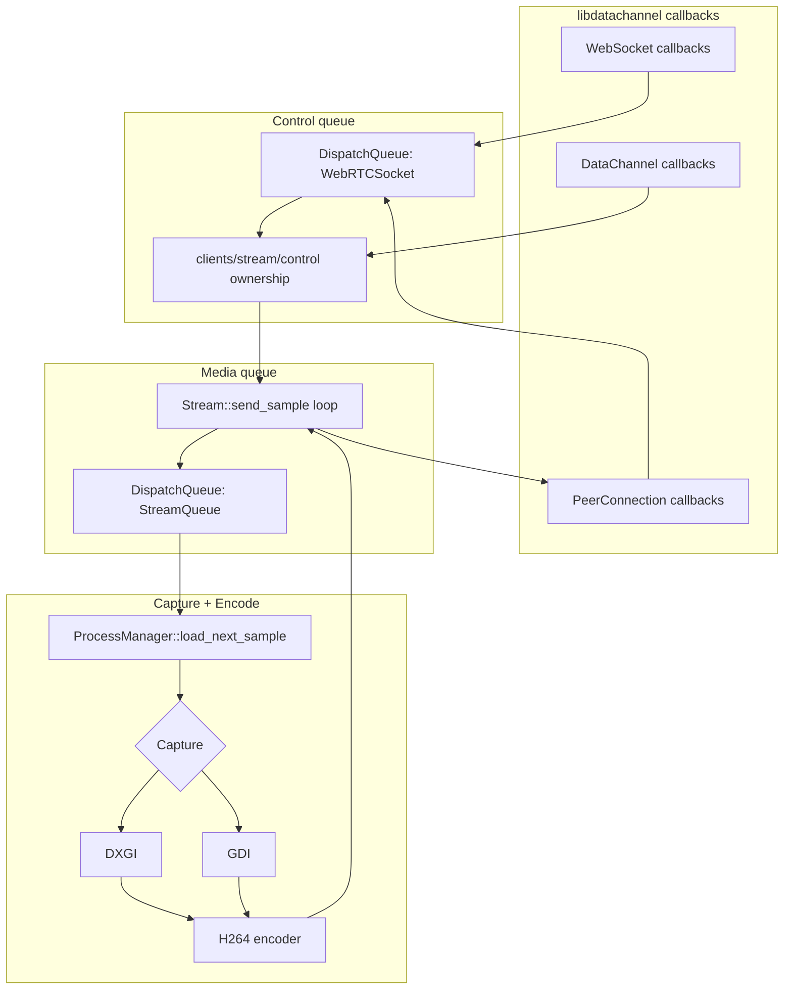

# 远程进程控制（WebRTC + 信令 + Windows 客户端）

## 目录分类（按角色）

- **前端（Web Client）**
  - `./frontend/index.html`、`./frontend/style.css`
  - **`./frontend/client.js`** — 页面逻辑（**单文件**，可 **`file://` 双击打开**）
  - **应用模式（不像网页）**：URL 加 **`?rpcWindow=1`**（或 **`kiosk=1`**）可隐藏控制台/状态区，**仅全屏远程画面**（底部 HUD/「退出」亦隐藏）。默认 **自动连接**（`autostart=0` 可关闭）。**无视频流**（超时默认 90s，可调 **`rpcVideoTimeoutMs=`**）、**信令 WebSocket 断开/错误**、**WebRTC 失败 / 视频轨结束 / 长时间 disconnected** 时会尝试 **自动关窗**（在 **WebView2 启动器 / Electron** 等提供 `rpcShell` 时可真正退出进程；纯浏览器 `--app` 可能需用户 **Alt+F4**）。仍可用 **`signaling=`**、**`windowTitle=`**。
  - **Electron 紧凑启动**（默认 `electronCompact=1`、先磁贴再双击连接）：**双击后**默认 **10s** 内须出现首帧（**`rpcVideoTimeoutMs=`** 覆盖）；信令 **10s** 未连上可关窗（**`rpcWsConnectTimeoutMs=`** 覆盖），且该计时在 **`autostart=0`** 时从 **双击发起连接** 起算，避免在磁贴页等待时误关。在 **尚未收到视频** 前，**不会因** WebSocket 断开/ICE `failed`/视频轨 `ended` 提前关窗（由上述超时统一处理）；**已出画后**再遇断流、轨结束、`disconnected` 超时等仍会 **自动关窗**（`remoteProcessExited` 等仍立即关）。紧凑模式无 **`rpcWindow=1`** 时也会正确识别「已出画」以清除无视频定时器。
  - **不用 Electron（推荐网络不佳时）**：**`./scripts/open-remote-app.ps1`**（可选 **`-WindowMode Kiosk`** 全屏无标题栏感，或 **`-WindowMode Fullscreen`**）或 **`./scripts/open-remote-app.bat`**；**`./webview2-launcher/`** — **.NET + WebView2** 可做成真正无边框窗。说明见 **`docs/WITHOUT_ELECTRON.md`**。
  - **`./frontend-electron/`**（可选）— **Electron** 外壳：直接加载 `frontend/index.html`（安装易卡住时可跳过）。
  - **`./frontend-vue-electron/`** — **Vue 3 + Vite**（**默认不含 Electron**），仍复用 `frontend/client.js`，见该目录 `README.md`。
  - **`docs/WITHOUT_ELECTRON.md`** — 无 Electron 的独立窗口方案；**`docs/VUE_ELECTRON.md`** — Vue 与独立窗口选型。
- **信令服务器（WebSocket Relay，Qt）**
  - `./signaling-server-qt/` — `SignalingServer` 门面 + `core/ClientRegistry` + `core/SignalingRelay`
- **服务器客户端（Windows：启动进程、采集窗口、H264 推流、输入注入）**
  - `./remote_process_control/`（VS 工程：`remote_process_control.vcxproj`）

详细分层与扩展点见 **`docs/ARCHITECTURE.md`**。

## 架构概览

前端与 Windows 客户端之间使用 WebRTC：

- **信令阶段**：前端通过 WebSocket 连接信令服务器，发送 `request`（含 `exePath`），信令服务器仅做“按 id 转发”。
- **媒体下行**：Windows 客户端采集目标进程窗口画面 → H264 编码 → RTP/WebRTC Track → 前端 `<video>` 播放。
- **控制上行**：前端把鼠标/键盘事件通过 WebRTC DataChannel 发给 Windows 客户端，客户端使用 `SendInput` 注入为真实输入。
- **并发**：支持多前端同时观看同一流；**默认仅允许 1 个前端获得控制权**（其他为只读观看，输入被忽略）。

## 远端核心架构（重点）

远端核心位于 `remote_process_control/`，按职责可分为：

- **会话编排层**：`webrtc_socket.*`
  - 处理 `request/answer/stop` 信令消息；
  - 管理客户端连接池、共享流生命周期、控制权仲裁。
- **单连接层**：`client_peer_connection.*`
  - 负责每个客户端的 `PeerConnection`、音视频 Track、DataChannel；
  - 处理输入事件 JSON，并调用输入注入。
- **媒体调度层**：`stream.*`
  - 维护音视频 sample 时间轴；
  - 按统一时钟推送到所有 Ready 客户端。
- **采集与编码层**：`process_manager.*` + `h264_encoder.*` + `dxgi_capture.*` + `window_capture.*`
  - 启动目标进程、定位窗口、采集帧、编码 H264；
  - 优先硬件路径（DXGI/硬件编码），不可用时自动回退。
- **输入注入层**：`input_controller.*`
  - 将前端坐标映射为屏幕坐标，调用 `SendInput` 注入鼠标键盘；
  - 记录输入活动，用于动态帧率策略（交互升帧、静止降帧）。

### 远端核心数据流（请求 -> 出画 -> 反向控制）

```mermaid
flowchart LR
    A[Frontend request/start] --> B[Signaling Server]
    B --> C[WebRTCSocket::_on_message]
    C --> D[ClientPeerConnection]
    D --> E[WebRTC SDP/ICE handshake]
    E --> F[Client Ready]
    F --> G[WebRTCSocket::_get_or_create_stream]
    G --> H[ProcessManager launch/find window]
    H --> I{Capture backend}
    I -->|DXGI| J[DXGICapture]
    I -->|fallback| K[WindowCapture]
    J --> L[RGB frame]
    K --> L
    L --> M[Dynamic FPS policy]
    M --> N[h264_encoder\nHW first, SW fallback]
    N --> O[H264 access unit]
    O --> P[Stream::on_sample]
    P --> Q[sendFrame to all ready clients]
    Q --> R[Frontend video render]
    R --> S[Mouse/Keyboard events]
    S --> T[DataChannel JSON]
    T --> U[ClientPeerConnection input handlers]
    U --> V[InputController + SendInput]
```

### 线程/队列模型（远端核心）

### 设计目标与当前策略

- **低延时优先**：编码器低延时参数、动态帧率、控制面与数据面分离。
- **稳定优先**：硬件路径不可用或失败时自动回退到软件路径，避免黑屏/断流。
- **多客户端观看**：同一条共享流可被多个前端观看；默认单控制者可输入。

## 已实现功能对照（对应你的 6 条）

1. **三组件齐全**：前端 + 信令服务器 + Windows 客户端。
2. **前端输入进程启动参数**：前端新增 `exePath` 输入框，随 `request` 发送。
3. **客户端截图/视频流**：客户端 `ProcessManager` 采集窗口并编码为 H264，经 WebRTC 视频 Track 推流。
4. **前端鼠标/键盘操作**：前端监听 `<video>` 区域鼠标/滚轮与键盘事件，通过 DataChannel 发送。
5. **客户端注入真实输入**：`InputController` 使用 `SendInput` 实现鼠标/键盘注入。
6. **多前端并发 + 限制控制端数量**：支持多连接同看；通过 DataChannel 的 `controlRequest` 机制限制控制权（默认 1 个控制者）。

## 延时诊断（日志）

用于拆分「采集/编码 / 网络与 RTP / 浏览器抖动缓冲与解码」等环节（**粗算总延时**，非逐像素精确）：

- **Windows 客户端控制台**：约每秒一行 `[latency][sender]`，含上一帧 `capture_ms`、`encode_ms`、`frame_unix_ms`。
- **浏览器开发者工具 Console**：`[latency]` 前缀日志，包括：
  - `latPong`：DataChannel RTT 与 **时钟换算 theta**（用于对齐 `frameMark` 的服务端时间戳）；
  - `frameMark`（每 15 帧）：发送端 cap/enc + **编码结束 → 本机收到 DC** 的估算；
  - `getStats`（约每 2s）：**抖动缓冲均值**、**解码均值/帧**、**ICE RTT**、**粗算总延时**（采集+编码+编码→DC+抖动缓冲+解码）；
  - `requestVideoFrameCallback`：约每 5s 一条，浏览器合成层 `presentationTime` 与回调 `now` 的差值。
- **视频 HUD**：画面下方 `延时: …` 为上述关键项的缩写（RTT / JB / 链 / Σ）。
- 若画面**只显示一帧不动**：① 发送端在**编码失败**时曾重复送同一帧（已修复）；② **`encode_rgb` 曾用全局 static PTS**，在**分辨率变化/重建编码器**（如主窗 HWND 重建）后 GOP 错乱，浏览器解码会卡住——已改为**每路 `ProcessManager` 独立 `m_encode_frame_seq` 并在重建编码器时归零**，请**重新编译 `remote_process_control`**。
- 若 **WebRTC 已连上但视频区一直黑/只有等待文案**：常见为 **`ontrack` 先收到视频再收到音频时，误把仅含音频的 `MediaStream` 赋给 `<video>`** 覆盖了画面——已改为**仅处理 `track.kind === 'video'`** 并单独绑定视频轨；`rpcWindow=1` 时收到视频轨后会**立即隐藏**高于画面的等待层。
- 若日志出现 **`rebound window by exe`** 后立刻 **`remote application window/process ended`**：多为 **Win11 记事本等 stub 进程先退出、真实窗口在另一 PID**，服务端曾误用 **`CreateProcess` 返回进程的退出码** 判死；已改为始终用 **`m_capturePid`**（rebound 后的采集进程）做 **`GetExitCodeProcess`**，请**重编 Windows 客户端**。
- **右键菜单向下超出主窗**时合成高度变大、画面发绿/纯色：多为 **分辨率突变后首帧非 IDR** 解码异常，以及菜单过长拉高画布；已 **在布局变化后强制关键帧**，并将合成区域 **限制在主窗底边 +1024px** 内裁剪（见 `capture_all_windows_image`），请**重编 Windows 客户端**。
- **远端进程关闭后自动退出视频层**：DataChannel **`remoteProcessExited`** 或 **视频轨 `ended`** 时，**`rpcWindow`/Electron** 仍自动关窗；**普通网页**会执行与「Stop Connection」相同的 **`stop()`**（退出全屏层、断开 WebRTC、恢复开始按钮）。见 `client.js` 中 **`exitVideoPageAfterRemoteStreamEnded`**。

## 运行方式（本机/局域网）

### 1）启动信令服务器（Qt）

在 `signaling-server-qt` 编译并运行：

- 默认监听：`0.0.0.0:9090`
- 也可传参：`signaling-server.exe <host> <port>`

### 2）启动 Windows 客户端（remote_process_control）

用 Visual Studio 打开 `remote_process_control.sln`，编译运行 `remote_process_control` 工程。

启动后会连接信令服务器（默认写死为 `127.0.0.1:9090`，可按需改为你的信令服务器地址）。

### 3）打开前端页面

- **直接双击** `frontend/index.html`（`file://`）即可；也可通过任意静态 HTTP 服务打开同一目录。

- **远程画面与 WebRTC 在同一页面内渲染**（`#video-stage` 全屏层中的 `<video>`），避免 `window.open` 子窗口无法显示 `MediaStream` 的黑屏问题（Chrome / Safari 等常见）。
- 开始连接或 **双击进程磁贴**（**记事本** / **Photoshop**，路径分别为系统记事本与 `C:\Program Files\Adobe\Adobe Photoshop CC 2019\Photoshop.exe`）后会 **自动尝试 Fullscreen API**（`navigationUI: 'hide'`），进入后浏览器 **标签栏/地址栏会隐藏**，仅显示黑色背景与视频；**系统级窗口标题栏无法由网页消除**，全屏是最接近「只有画面」的方式。
- 若浏览器未自动全屏，可 **再点一下视频画面** 或 **双击黑色区域边缘** 重试；全屏时鼠标移到 **底部** 可短暂看到分辨率与「退出画面」。
- **Esc**：先退出全屏，再按一次 **Esc** 关闭远程画面层（连接仍保持时可再次双击图标打开）。
- 视频默认 **muted** 以满足自动播放策略。
- 磁贴会先把对应路径写入 `exePath` 再发起连接；若需其他程序，点击 **⚙** 展开手动编辑 `exePath` 与停止策略。**切换应用前请先 Stop**，再双击另一磁贴（否则会仅复用当前 WebRTC 画面）。
- **点击视频区域使其获得焦点后**，键盘才会发到远端。
- 点 `Stop Connection` 会结束 WebRTC 并 **清空视频**、关闭全屏层；若策略为结束进程，远端进程会一并退出。

### 鼠标坐标

- 前端按 **视频原始分辨率** 并扣除黑边（`object-fit: contain`）发送坐标；Windows 端映射到 **被采集窗口的 `GetWindowRect`**，并支持多显示器（虚拟桌面绝对坐标）。

## 重要约束/说明

- 该工程当前以 **Windows GUI 进程窗口采集** 为主；如果目标进程无窗口或被 UAC/权限隔离，采集/注入可能失败。
- 并发控制默认 **1 个控制者**：前端 DataChannel 打开后会自动发送 `controlRequest`；未获得控制权时 `isControlEnabled=false`，仍可观看视频。

## 后续建议（可继续增强）

- 把 Windows 客户端的信令地址、最大控制数、默认进程路径做成配置文件/命令行参数。
- 在信令层增加鉴权、房间/会话概念；控制权可支持抢占/排队/超时。

