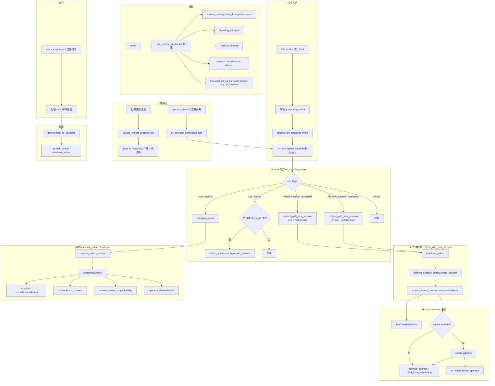
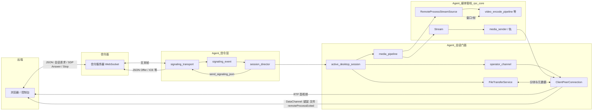

# remote_desktop_agent：主要业务流程与数据流

本文档与 `remote_desktop_agent` 当前实现一致，便于评审与 onboarding。

---

## 1. 主要业务流程图（生命周期 + 信令驱动）

**要点（与代码一致）**

- 全局**至多一个** `m_active_session`；新 `media_session_requested` / `file_only_session_requested` 先 **`teardown_active` 再建会话**（`always_replace_session_policy` 可扩展是否允许替换）。
- **SDP Answer** 仅当 `event.client_id == m_current_client_id` 时交给当前会话。
- **编排与多数回调**经 `session_director` 的 `DispatchQueue`（`m_task_queue`）串行化，避免与 libdatachannel 回调线程直接交织。

---

## 2. 数据流图（信令 / WebRTC / 媒体与控制）

**数据语义简述**

| 方向 | 载体 | 内容 |
|------|------|------|
| 入站信令 | WebSocket 文本 | 会话请求、SDP Answer、`stop` 等 → `signaling_event` |
| 出站信令 | WebSocket 文本 | Offer、ICE 候选等（由 `operator_channel` / `PeerConnection` 驱动，`send_signaling_json`） |
| 媒体 | RTP（经 libdatachannel） | 编码后的视频；静音 Opus 等 |
| 控制 / 侧车 | DataChannel JSON | 远程输入、文件传输协议、`type=remoteProcessExited` 广播 |
| 本地 | 共享内存 / 回调 | 采集 → 编码 → 入轨；进程生命周期与窗口选择 |

---

## 3. 与源码对应关系（快速索引）

| 节点 / 概念 | 主要文件 |
|-------------|----------|
| 应用装配与退出 | `app/main.cpp`, `app/rpc_remote_application.cpp` |
| 信令解析与线程收敛 | `signaling/signaling_transport.cpp`, `signaling/signaling_event.h` |
| 单会话 + 替换策略 | `orchestration/session_director.cpp`, `orchestration/session_replace_policy.h` |
| 会话装配与拆除 | `orchestration/active_desktop_session.cpp`, `orchestration/desktop_session_factory.cpp` |
| 单 Peer WebRTC | `webrtc/operator_channel.cpp` |
| 媒体组装 | `media/media_pipeline.cpp` |
| 采集 / 编码 / 发送实现 | `rpc_core/**` |

如需导出为图片，可在本地使用 [Mermaid CLI](https://github.com/mermaid-js/mermaid-cli) 或支持 Mermaid 的 Markdown 预览工具渲染本文档。
